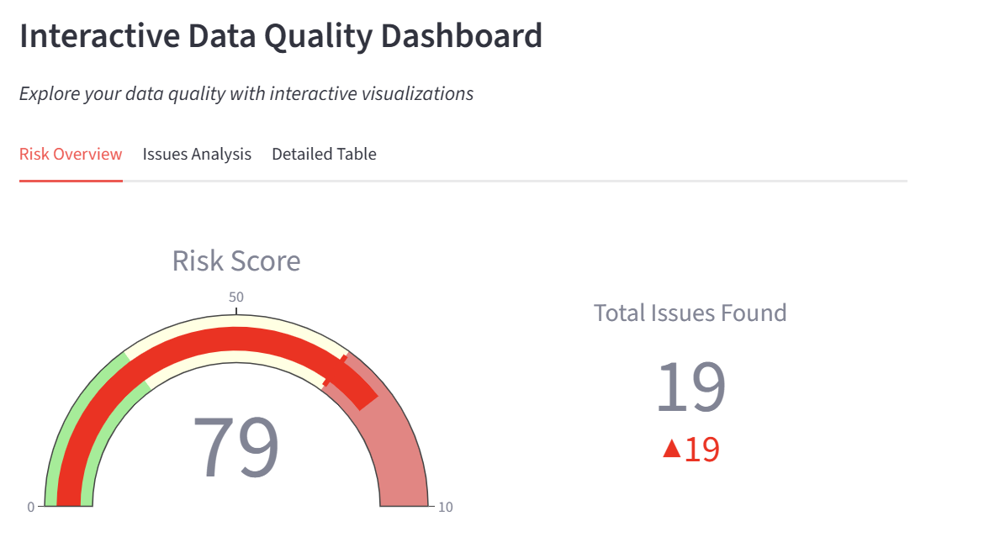
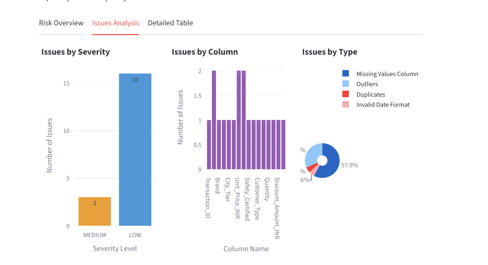
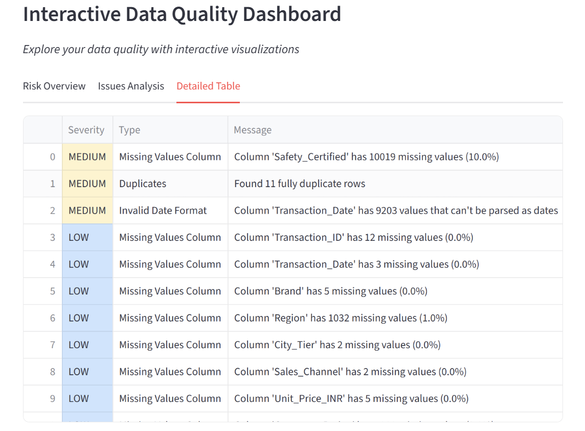

# DataQA - Data Quality Assessment Tool

A Python tool that checks datasets for common quality issues and provides a risk score to assess data readiness before analysis.

---

## What It Does

DataQA validates datasets by checking for:
- Missing values
- Duplicate records
- Invalid data types
- Date format issues
- Statistical outliers
- Required columns
- Value range violations
- Unnamed columns

Each issue is classified by severity (HIGH, MEDIUM, LOW) and combined into a risk score from 0-100.

---

## Features

- Interactive web dashboard with Streamlit
- Risk score calculation (0-100 scale)
- Visual charts showing issue distribution by severity, column, and type
- Exports to Excel, HTML, and CSV
- Handles datasets from 200 to 100K+ rows

---

## What It Actually Does

Here's what happens when you upload a file:

**The tool checks 8 common problems:**
- Missing values (the silent killer)
- Duplicate rows (why is everything doubled?)
- Wrong data types (why is "price" stored as text?)
- Weird date formats
- Outliers that don't make sense
- Columns that shouldn't be there
- Values that are out of reasonable ranges
- Those annoying "Unnamed" columns

**Then it gives you:**
- A risk score (0-100, where 0 is perfect)
- A color-coded severity level (green/yellow/orange/red)
- Interactive charts showing where the problems are
- A detailed list of every issue found
- Recommendations on what to fix first

---

## Validation Results

Testing was conducted on real-world datasets from Kaggle to validate detection accuracy:

**Small Dataset: Amazon Laptops (Web-Scraped Data)**
- Original: 209 rows, 15 issues detected, Risk Score: 66/100 (HIGH)
- Corrupted: 232 rows, 18 issues detected, Risk Score: 97/100 (CRITICAL)

**Large Dataset: Indian Toy Sales (Retail Data)**
- Original: 100,000 rows, 12 issues detected, Risk Score: 40/100 (MEDIUM)
- Corrupted: 100,030 rows, 19 issues detected, Risk Score: 79/100 (CRITICAL)

| Dataset | Rows | Issues | Risk Score | Status |
|---------|------|--------|------------|--------|
| Amazon Laptops (original) | 209 | 15 | 66/100 | HIGH |
| Amazon Laptops (corrupted) | 232 | 18 | 97/100 | CRITICAL |
| Indian Toy Sales (original) | 100,000 | 12 | 40/100 | MEDIUM |
| Indian Toy Sales (corrupted) | 100,030 | 19 | 79/100 | CRITICAL |

Corrupted datasets included missing values (30%+), duplicate records (20%+), invalid data types, format inconsistencies, statistical outliers, and constraint violations. All issues were successfully detected with appropriate severity classification.

---

## Dashboard







---

## Installation

```bash
# Clone the repository
cd EDA_Automation

# Install dependencies
pip install -r requirements.txt
```

---

## Usage

**Web Interface:**
```bash
streamlit run app.py
```

**Command Line:**
```bash
python run_validation.py your_data.csv
```

Reports are saved to the `outputs/` folder.

---

## Test Results

Tested on Kaggle datasets:

| Dataset | Rows | Issues | Risk Score |
|---------|------|--------|------------|
| Amazon Laptops (original) | 209 | 15 | 66/100 (HIGH) |
| Amazon Laptops (corrupted) | 232 | 18 | 97/100 (CRITICAL) |
| Indian Toy Sales (original) | 100,000 | 12 | 40/100 (MEDIUM) |
| Indian Toy Sales (corrupted) | 100,030 | 19 | 79/100 (CRITICAL) |

Processing time: < 1 second for small datasets, ~3 seconds for 100K rows.

---

## Tech Stack

- Python 3.13
- Streamlit - Web interface
- Pandas - Data processing
- Plotly - Interactive visualizations
- Matplotlib & Seaborn - Charts

---

## License

MIT License

---

**Version 1.0** • February 2026
